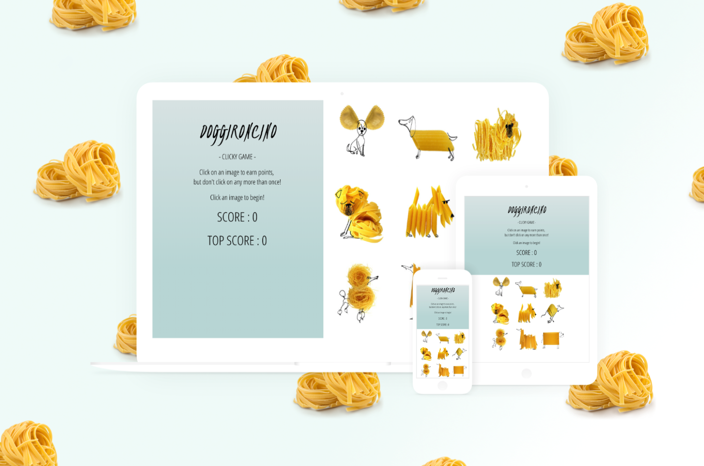

# DOGGIRONCINO - ClickyGame

This is a memory game built with React.JS. Try and click all the pasta dogs without repeating yourself. After each click the game shuffles the cards.
If you repeat guesses, you lose and the score is reset to 0, it also keeps track of your top score. Enjoy!

### Technologies used

- React
- ES6
- JavaScript
- JSX
- Node

#### Screenshots

